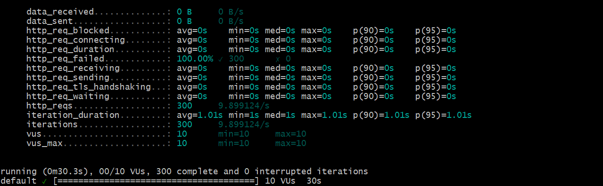

# K6

O k6 é uma ferramenta de teste de desempenho open-source, projetada para ser utilizada em testes de carga e de performance para aplicações web. O k6 permite aos desenvolvedores simular tráfego para uma aplicação ou serviço web de forma a testar como ele se comporta sob diferentes condições de carga. Isso é crucial para identificar gargalos de desempenho e garantir que uma aplicação possa lidar com o volume esperado de tráfego e interações do usuário.

## Qual utilidade?

Para avaliar a performance e a estabilidade da aplicação da Track.co, foi crucial a realização de testes de carga nos endpoints do projeto. O k6 foi utilizado como a ferramenta chave neste processo, permitindo-nos simular uma carga intensa de tráfego direcionada a esse endpoint. Este teste envolveu a configuração de cenários que imitam o comportamento de múltiplos usuários acessando o getDistribution simultaneamente, com o objetivo de identificar como o sistema se comporta sob pressão.

## Conceitos aprendidos

Realizando esses testes foi possível aprender alguns dos conceitos básicos que envolvem o k6, como:

- Realização de Testes de Script

- A simulação de usuários virtuais

- A coleta de métricas para ver o desempenho da aplicação

## Testes realizados

